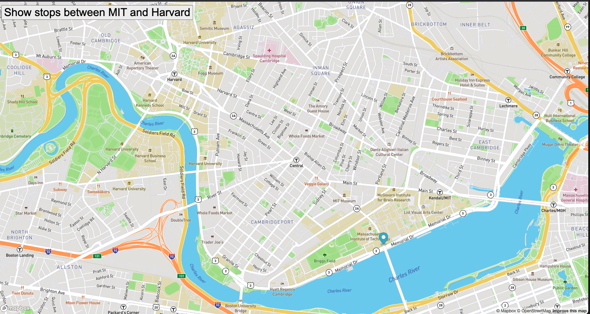

# Show Stops Between MIT and Harvard
## Exercise on Real Time BusStop Tracker using mapbox API

Description of project:
This project brings real time data from the API mapbox, allowing us to edit the map using its coordinates and our own understanding of CSS and more importantly using logic to iterate among a list of coordinates of the stops from the MIT to HARVARD campus. We created a marker at the first stop and as we iterate along the array of coordinates, we create a new marker on the map until we reach the last index of the stops array.

How to Run:

navigate to index.html and click on "Show Stops between MIT and Harvard, and watch the marker move along the map where the bus stops. 

Roadmap of future improvements:

future improvements of this project can be incorporating different methods of transportation from Harvard to MIT campus besides the bus - calculating how long it will take to get from point A to B, and choose which is a better option given the time of day.

